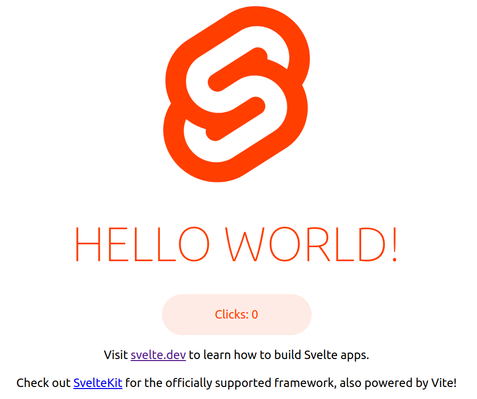
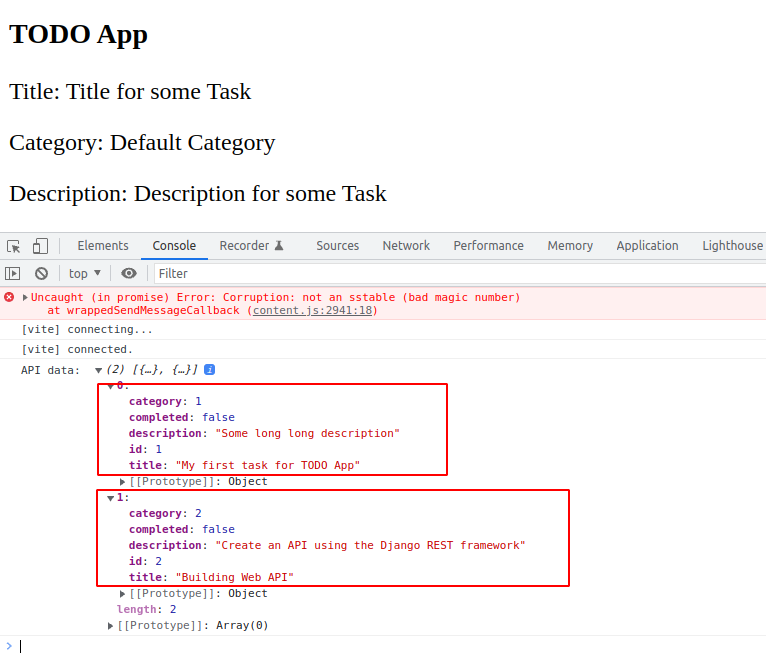
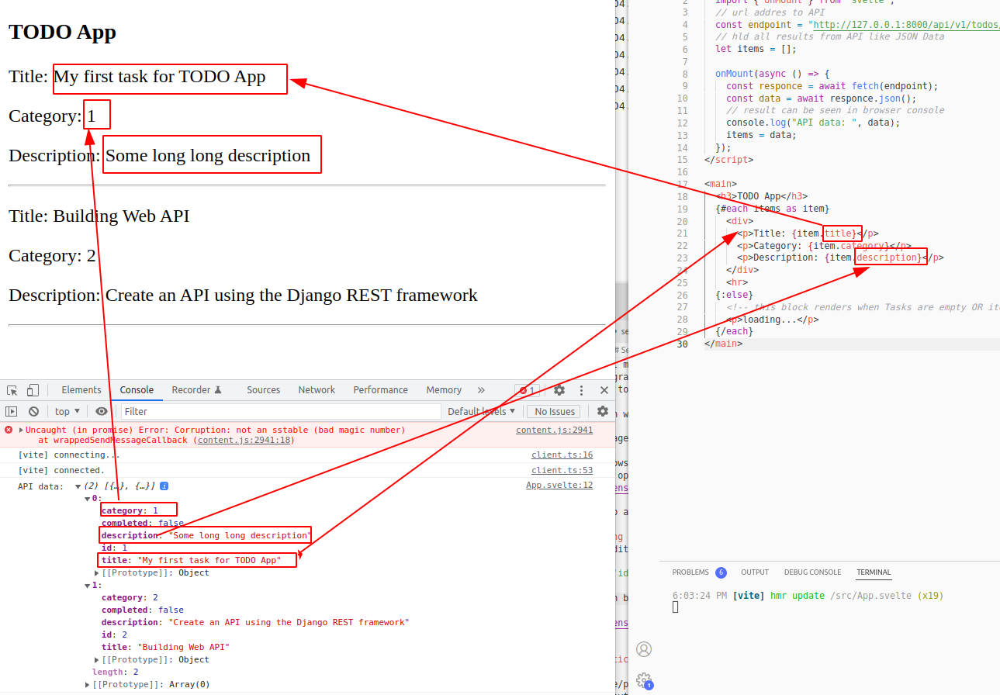

## Svelte TODO App like front-end only 
This tutorial is related with [Django Backend TOD app](https://github.com/sivanov/api-django)

##  Installation
In order to work with Svelte, you need to have Node.js installed.
instal on debian based distributions:
```
sudo apt install nodejs
```
check installed version :
```
node -v
```

Open terminal and navigate to directory when we wil create new project folder

```
npm init vite frontend-svelte -- --template svelte
```
aswer like this on some questions in terminal
```
Ok to proceed? (y) : type "y" + Enter
```
now navigate from terminal to folder that was created:
```
cd frontend-svelte
```
Install needed  NPM packages with command:
```
npm install
```
This will take some time, please be patient
To see if website work run command:
```
npm run dev -- --open
```
This will open new tab in you default browser with title: "HELLO WORLD!"


## Creating home page
Open and edit file: /src/App.svelte. Delete all content inside and replace it with this:
```html
<script>
  // place for new JS code
</script>

<main>
  <h1>TODO App</h1>
  <p>
    in progress...
  </p>
</main>
```
After file is saved Svelte will automatically detect changes and webpage will refresh/update instantly.

Edit again App.svelte file like this:
```html
<main>
  <h3>TODO App</h3>
    <div>
      <p>
        Title: Title for some  Task
      </p>
      <p>
        Category: Default Category
      </p>
      <p>
        Description: Description for some  Task
      </p>
    </div>  
</main>
```
For now information will be static, after we write javascript code that will get JSON data from API backedn.
Edit again same file:
```html
<script>
	import { onMount } from "svelte";
  // url addres to API
	const endpoint = 'http://127.0.0.1:8000/api/v1/todos/'
  // hld all results from API like JSON Data
	let items = []

	onMount(async () => {
		const responce = await fetch(endpoint)
		const data = await responce.json()
    // result can be seen in browser console
		console.log("API data: ", data)
		items = data;
	})
</script>
```
After page is reload in console can see this( to open console pres key combination: Ctrl + Shift + i):


By this way we debugging what's happening with JSON Data inside code.

Edit again file:
```js
<main>
  <h3>TODO App</h3>
  {#each items as item}
    <div>
      <p>Title: {item.title}</p>
      <p>Category: {item.category}</p>
      <p>Description: {item.description}</p>
    </div>
    <hr>
  {:else}
    <!-- this block renders when Tasks are empty OR items.length === 0 -->
    <p>loading...</p>
  {/each}
</main>
```
Now date inside ```<p>``` tags is dynamically generated
